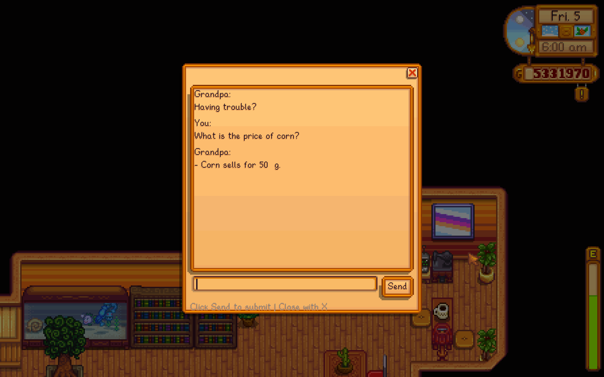
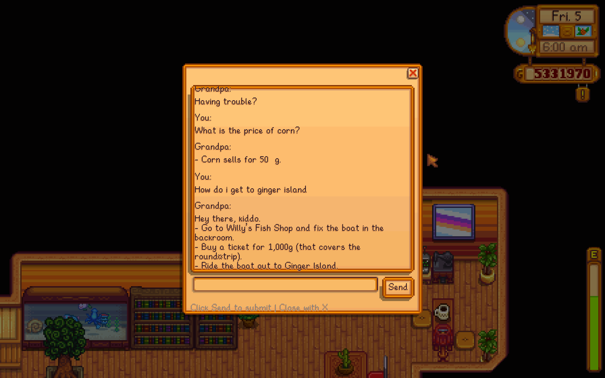

#  🌾 Stardew_Grandpa_GPT

A GPT mod for Stardew Valley, provides in game assistant

---

## ✨ Features

- 🗨️ In-game chatbox interface  
- 🔎 Semantic similarity search using text embeddings  
- 🗂️ Local SQLite-based vector database  
- 🤖 AI-generated responses grounded in retrieved content  
- ⚡ Seamless integration inside the game 

---

##  🧠 Workflow

This project follows a Retrieval-Augmented Generation (RAG) architecture:

1. **User Input (In-Game Chatbox)**  
   The player types a question inside the in-game chatbox.

2. **Text Embedding (Cloudflare AI)**  
   The question is sent to the Cloudflare text embedding model.  
   The model converts the input text into a high-dimensional embedding vector.

3. **Similarity Search (SQLite Vector Database)**  
   - The embedding is compared against precomputed embeddings stored in SQLite.  
   - A similarity search is performed.  
   - The Top-N most relevant chunks are retrieved.

4. **Context Construction**  
   The retrieved chunks are combined with the original user question to form a context-aware prompt.

5. **Text Generation (Cloudflare AI)**  
   The augmented prompt is sent to the text generation model.  
   The AI generates a response grounded in the retrieved content.

6. **Response Display**  
   The generated answer is displayed back inside the in-game chatbox.

---

## 📸 Screenshots

Below are example screenshots of Stardew Valley GPT running inside the game.

